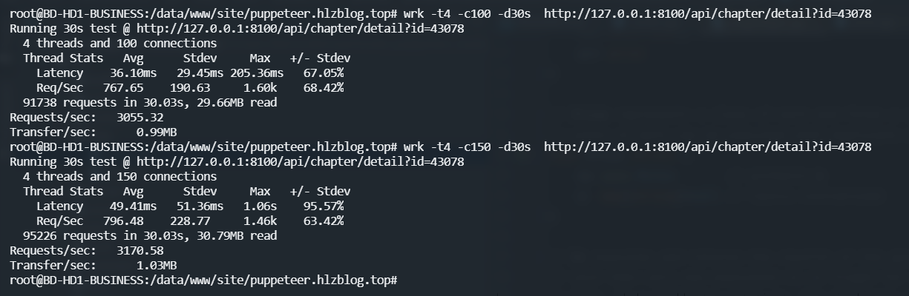
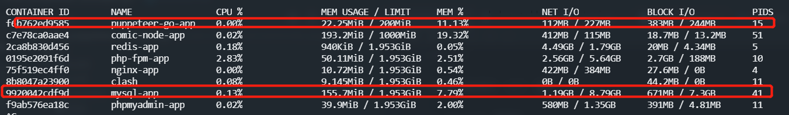
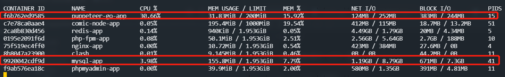

## 序言

漫画爬虫配套的 `API` 服务  

* `go mod` 管理包
* `Makefile` 集成命令
* [查看接口文档](http://api_puppeteer.doc.hlzblog.top/)  

### 性能表现
本次压测因条件限制，在业务宿主机(2c/2G)上直接进行的压测  

最大支持 `QPS` 在 `3170` 左右  
最大支持 `150` 个并发连接数左右  

其实本次压测的 `API` 基于本地缓存 `singlefight` 做的本地 `一级接口级缓存` 的  
但是作者本人并没有那么多时间去做更多的性能优化，如 `Redis做二级缓存`  

  
`图 01 - API性能表现`

作者本次就直接展示下压测前后的业务机环境的资源运用情况了  

压测前 如 `图 02`
  
`图 02`  

压测时 如 `图 03`
  
`图 03`  

可以看到本次瓶颈不在 `CPU`、`DB` 资源消耗上  
而是在 `网络I/O` 上  

> 拓展思维

`列表页` 可以考虑下数据的缓存预热，从外在每次有对表进行数据变更的时候，重新触发全部【目前量不大】预热即可  
其他的API等待着其他小伙伴自行思考  

> 相关文章

有兴趣的读者朋友可以通过 [http://www.hlzblog.top/article/74.html](http://www.hlzblog.top/article/74.html)  
分析下平时压测的`API` 瓶颈是哪里

> 运行前要求

生成好 `app.ini`  

~~~bash
make ini
~~~

### 使用步骤

> 调试阶段

~~~bash
make
~~~

如果修改了 `Model` 层数据结构，请重新生成 `easyjson` 
~~~bash
make json
~~~

> 生成并运行应用

~~~bash
make clean && make build && make run
~~~

> 格式化代码

~~~bash
make tool
~~~

> 优雅关闭

会监听指定信号 ctrl+c 、kill 进程Pid，关闭各种链接后，慢慢退出  

~~~bash
- 请不要用 kill -9 程序监听不到退出
- 调试的时候 kill 目标请杀掉对应 tmp 进程即可 
~~~

###### 注意事项

> Goland

在 `goland` 的 `setting` 里设置启用`Go Modules`  

~~~bash
goland Preference->Go->Go Modules(vgo) -> Enable Go Modules(vgo)intergration
~~~