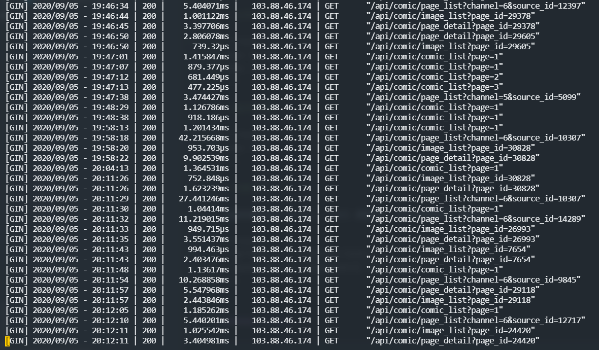

## 序言

漫画爬虫配套的 `API` 服务  

* `go mod` 管理包
* `Makefile` 集成命令
* [查看接口文档](http://api_puppeteer.doc.hlzblog.top/)  

### 性能表现

  
`图 01 - API性能表现`  

因部分 `漫画列表页` 数据量可能大一些，所以可能会超过 `10ms` 的响应结果  

> 运行前要求

生成好 `app.ini`  

~~~bash
make ini
~~~

### 使用步骤

> 调试阶段

~~~bash
make
~~~

如果修改了 `Model` 层数据结构，请重新生成 `easyjson` 
~~~bash
make json
~~~

> 生成并运行应用

~~~bash
make build && make run
~~~

> 格式化代码

~~~bash
make tool
~~~

> 优雅关闭

会监听指定信号 ctrl+c 、kill 进程Pid，关闭各种链接后，慢慢退出  

~~~bash
- 请不要用 kill -9 程序监听不到退出
- 调试的时候 kill 目标请杀掉对应 tmp 进程即可 
~~~

###### 注意事项

> Goland

在 `goland` 的 `setting` 里设置启用`Go Modules`  

~~~bash
goland Preference->Go->Go Modules(vgo) -> Enable Go Modules(vgo)intergration
~~~